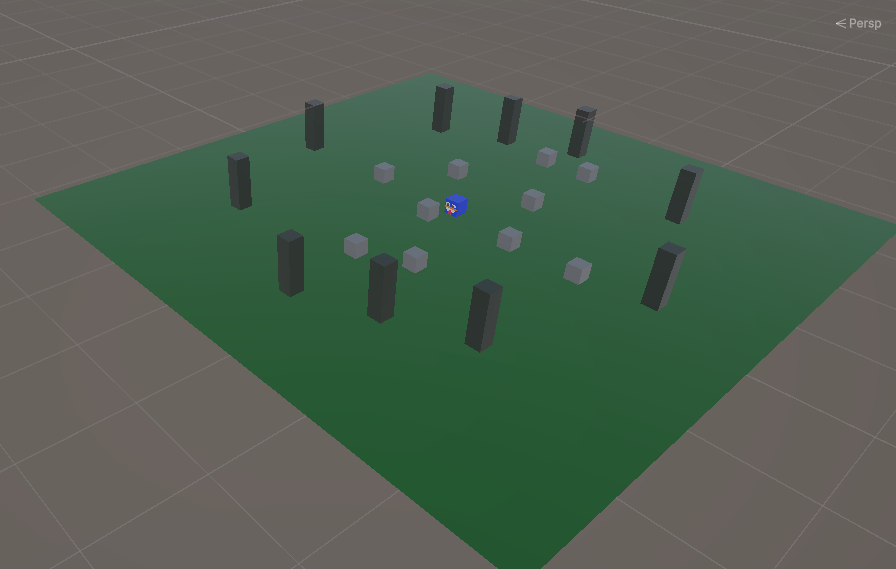
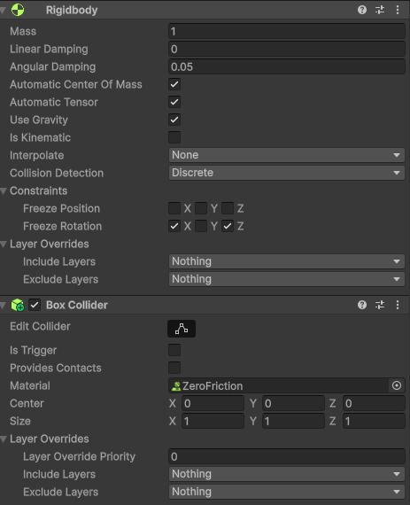
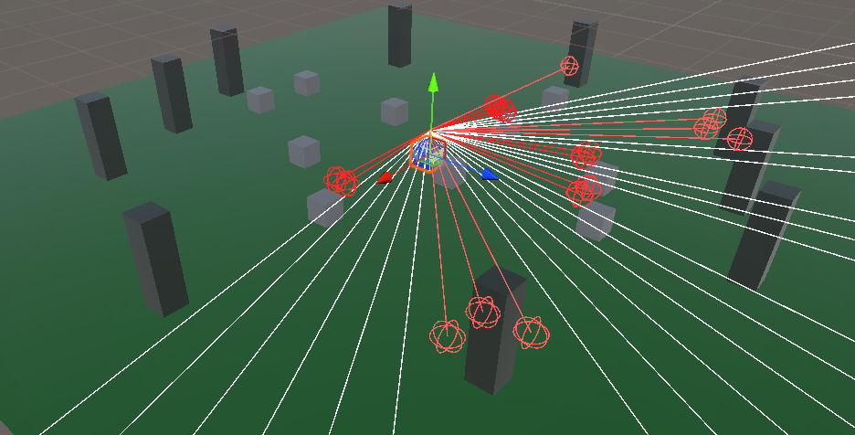
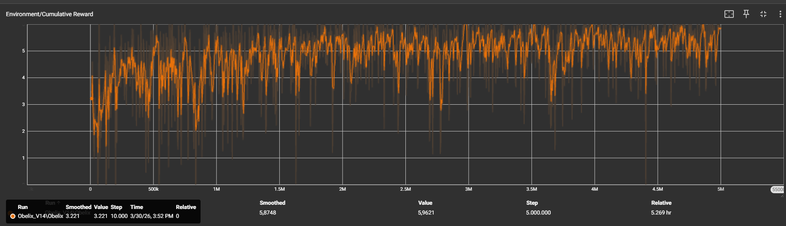
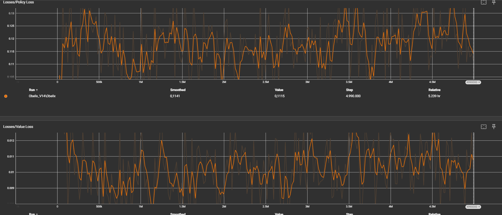
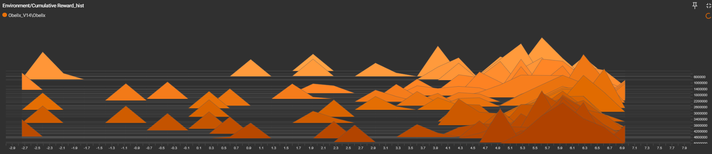

Technisch
Rapport: Opdracht Obelix

Inleiding

 
Dit rapport bevat het onderzoeken van de ontwikkeling en
optimalisatie van een autonome agent in een 3d omgeving.Het doel van dit is om
de technische implementatie, de gemaakte ontwerpkeuzes en het resultaat van de
leerprestaties van de agent overzichtelijk weer te geven. Dit onderzoek is voor
inzicht te geven van navigatieproblemen waar visuele obstakels en willekeurige
objecten een rol spelen kunnen worden opgelost met hulp van Reinforcement
Learning-algoritmen. Het rapport is voor technische evaluaties voor AI.
Methode
Voor de opdracht werd Unity en ML-Agent samen gebruikt.
Omgevingsconfiguratie en ruimte
De simulatie is op een speelveld van 40x40. De taak bestond
uit het vinden, verzamelen en afleveren van tien objecten(menhirs) naar 10 vast
geplaatste doelen (destinations). De posities van de menhirs en de startpositie
van de agent werden bij start van elke episode willekeurig bepaald. De agent had
discrete acties: lineaire verplaatsing(vooruit/stilstaan) en rotaie om de Y-as
(links/rechts/stilstaan).
Fysica en sensoren

Om de interactie met de omgeving zo goed mogelijk te maken,
werden fysieke paramaters bijgesteld. Er werd een Physic Material met zero
friction op de agent en objecten geplaats om vastlopen tegen te gaan. De
menhirs kregen een Linear en Angular Damping van 10, samen met rotatie
restricties, om onvoorspelbaar gedrag te voorkomen.

Voor het zicht werd Ray Perception Sensor 3D gebruikt. Om
blinde vlekken te voorkomen werd de Start Vertical offset verhoogd en End vertical
offset verlaagd. Sphere cast radius werd verkleind zodat de stralen tussen de
palen konden.
Trainingsparameters en beloningsstructuur
Er werd getraind met Proximal policy optimization (PPO)
algoritme. In latere iteraties werd Long Short-Term Memory (LSTM) neuraal
netwerk toegevoegd om sequentiële besluitvorming mogelijk te maken. De beloningsstructuur
is zoals dit opgebouwd:
·        Oprapen van een object: +0.1
·        Tussentijdse aflevering: +0.8
·        Voltooien van de laatste aflevering: +1.0
·        Tijdstraf per stap: -0.0005 Om het model
voldoende tijd te geven de complexiteit van de tien objecten te overzien, werd
de max_steps parameter ingesteld op 5.000.000.
Resultaten
De prestaties van het leren van het model werd geanalyseerd
aan de hand van de TensorBoard grafieken.
Cumulatieve Reward

Bij het bekijken van de Environment/Cumulative Reward
grafiek is een progressie zichtbaar. Waar eerdere versies overwegend negatieve
beloningen accumuleerden, toonde iteratie V14 (de oranje curve) na een stijgfase
een afgevlakte curve die stabiliseert rond een waarde van 5.96. De ruwe,
onderliggende data toonde wel een hoogfrequent zaagtandpatroon met duidelijke
variantie. Pieken in de onbewerkte data bereiken waarden boven de 6.0, terwijl
de diepste punten terugvallen tot rond de nul of lichte negatieve waarden.
Loss-metrieken en histogrammen

De Losses/Policy Loss curve vertoont in de eerste fase een
snelle stijging, waar dit gedurende de rest van de vijf miljoen stappen rond
een constante waarde van om en nabij 0.12 blijft fluctueren. De Losses/Value
Loss begint met hoge afwijkingen, maar daalt snel en komt samen richting de
x-as.

De bijgevoegde Cumulative
Reward_hist histogrammen laten een verschuiving zien in de massadistributie van
de beloningen; bij V14 is er sprake van een duidelijke concentratie van
resultaten in het positieve spectrum ten opzichte van eerdere iteraties.
Conclusie
Op basis van de resultaten lijkt het erop dat de agent
succesvol een strategie heeft geleerd om de taak te voltooien. Het bereiken van
een stabiel plateau rond een gemiddelde beloning van 5.96 in de Cumulative
Reward grafiek, in combinatie met het uitvlakken van de Value Loss, toont aan dat
de trainingstijd van vijf miljoen stappen voldoende was. De agent behaalde hier
waarschijnlijk de maximaal haalbare beloning voor deze opstelling.
De sterke variantie in de ruwe data (het zaagtandpatroon) komt
door de kans van de omgeving; wanneer objecten ver verspreid liggen, resulteert
dit in een langere aflegtijd en als gevolg een zwaardere cumulatieve tijdstraf.
Daarnaast wekt het verschil in prestaties tussen de vroege
en late iteraties de indruk dat het gebruiken van fysieke frictie-aanpassingen
en het integreren van LSTM-geheugen bepalende factoren zijn geweest. Het
LSTM-netwerk lijkt de agent in staat te stellen om de locaties van objecten
tijdelijk te onthouden wanneer deze zich, ten gevolge van rotatie of occlusie,
buiten het bereik van de sensoren bevinden. Er kan een conclusie genomen worden
dat er een betrouwbaar model is gemaakt voor autonome navigatie onder de
beschreven omgevingsvariabelen.
Referenties
Unity
Technologies (2023) ML-Agents Toolkit Documentation. Beschikbaar
via: https://github.com/Unity-Technologies/ml-agents
AP Hogeschool Antwerpen (2026) Cursusmateriaal VR
Experience. Elektronische leeromgeving AP Hogeschool. Beschikbaar via: https://learning.ap.be/course/view.php?id=71804
Google
(2026) Gemini (Large Language Model). Beschikbaar via: https://gemini.google.com
