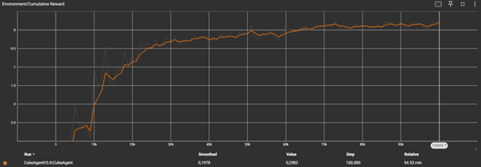
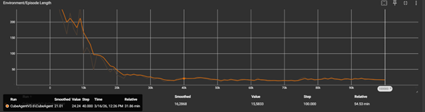

# Technisch Rapport ML-Agents Deel 1: Sequentiële Doelstellingen en Ray Perception in Unity

Dit rapport beschrijft de opzet, ontwikkeling en training van een AI agent binnen een Unity-omgeving met behulp van de ML-Agents toolkit. Het primaire doel van dit project is het demonstreren van de basisprincipes van reinforcement learning in de praktijk. Specifiek wordt onderzocht hoe een agent getraind kan worden om een sequentiële taak succesvol uit te voeren: het lokaliseren en verzamelen van een doelobject, onmiddellijk gevolgd door het navigeren naar een gedefinieerde eindbestemming (de groene zone in de scene).
Dit document is bedoeld voor ontwikkelaars en studenten die inzicht willen in de configuratie van ML-Agents. De verschuiving van een standaard enkelvoudig doel naar een meervoudig probleem biedt een belangrijke casestudy over hoe een neuraal netwerk omgaat met fasering, tijdstraffen en omgevingswaarnemingen tijdens het trainingsproces.
Tijdens de ontwikkeling van het C#-script is ter ondersteuning gebruikgemaakt van een AI-assistent (Gemini) voor code-optimalisatie en foutopsporing.

## Methoden
### Primaire Componenten: Behavior Parameters & Agent

De configuratie in de Unity Editor steunt op twee primaire componenten om de machine learning omgeving vorm te geven. Ten eerste is er het Behavior Parameters component, dat dient als de brug tussen de Unity-omgeving en het neurale netwerk. Hierbij is de Vector Observation Space Size ingesteld op 10, om alle coördinaten en de status van het huidige doel correct door te geven. De Continuous Actions zijn vastgesteld op 2, wat de agent in staat stelt om tegelijkertijd te navigeren (vooruit/achteruit) en te roteren.
Ten tweede maakt de agent gebruik van een Ray Perception Sensor 3D. Deze sensor zendt virtuele stralen uit om de omgeving te scannen op objecten met specifieke tags (zoals het te verzamelen blokje en de groene eindzone), waardoor de agent de ruimte kan creëeren naast de numerieke coördinaten.

### Override Methods van de Agent 
Het gedrag van de agent wordt in de code aangestuurd door vier overschreven basismethoden vanuit de ML-Agents bibliotheek:

* **OnEpisodeBegin()**: Deze methode wordt geactiveerd bij de start van elke nieuwe trainingsronde (episode). Het herstelt de beginstatus van de omgeving. Dit wil zeggen het resetten van de positie en rotatie van de agent (als deze van het platform is gevallen), het verplaatsen van het te verzamelen target object naar een willekeurige locatie en het resetten van de faseregeling (geheugenvariabele of het object al verzameld is of niet).
* **CollectObservations()**: Hierin wordt de state-informatie van de omgeving verzameld en aan het brein gevoerd. Dit zijn de exacte lokale posities van de agent, het doelobject en de groene zone, ook een waarde die aangeeft in welke fase van de taak de agent zich bevindt.
* **OnActionReceived()**: Deze methode vertaalt de acties vanuit het beslissingsmodel naar effectieve fysieke bewegingen (translate en rotate) van de agent. Belangrijker nog is dat hier het beloningssysteem is geïmplementeerd. Er worden positieve waarden toegekend voor het correct voltooien van taken (het aanraken van het blokje en vervolgens de groene zone) en negatieve waarden afgetrokken wanneer de agent van de wereld valt of om tijdverlies te verkomen.
* **Heuristic()**: Deze methode zorgt voor de handmatige toetsenbordinput voor de actiebuffers van de agent. Dit maakt het mogelijk om de omgeving en de geschreven logica zelf te testen en te valideren op haalbaarheid (zoals bewegingssnelheid en het correct triggeren van de doelen) voordat het geautomatiseerde trainingsproces te doen.

## Resultaten
Tijdens het trainingsproces van het neurale netwerk zijn de prestaties van de agent gemonitord over een verloop van 100.000 stappen. Uit de verzamelde data komen twee voornaamste observaties naar voren:

Ten eerste toont de grafiek van de Cumulative Reward (zie : Ontwikkeling van de Cumulative Reward over 100.000 stappen) een sterke stijging van de geaccumuleerde beloning. Vanaf de grens van ongeveer 31.000 stappen neemt de hellingsgraad van deze stijging af. Rond de 70.000 stappen stabiliseert de curve zich en vormt een duidelijk plateau rond een gemiddelde beloningswaarde van -0.11.
Ten tweede laat de grafiek van de Episode Length (zie : Ontwikkeling van de Environment/Episode Length over 100.000 stappen) zien dat de episodes in de beginfase van de training relatief lang duren, met uitschieters tot boven de 200 stappen per episode. Naarmate het aantal trainingsstappen toeneemt, daalt deze lengte aanzienlijk. Vanaf circa 40.000 stappen bereikt de grafiek een laag en stabiel niveau. Vanaf dat punt blijft het aantal benodigde stappen om een episode af te ronden nagenoeg constant tot aan het einde van de training.

## Conclusie
Uit de data kan worden afgeleid dat de AI-agent de sequentiële taak succesvol heeft aangeleerd. De sterke daling in de lengte van de episodes, gecombineerd met een vervlakking van de cumulatieve beloning rond het maximaal haalbare niveau, toont aan dat het Proximal Policy Optimization (PPO) algoritme effectief een optimale policy heeft gegenereerd.
Het model slaagt erin om de doelen (eerst het verzamelen van het doelobject, vervolgens navigeren naar de eindzone) in de juiste volgorde uit te voeren. Dit bewijst dat de configuratie van de Ray Perception Sensor voldoende ruimtelijke waarnemingen (observaties) aanlevert om de omgeving correct te interpreteren. Ook blijkt de ingestelde tijdstraf (existential penalty) effectief te functioneren; de agent optimaliseert de route om zo min mogelijk stappen te verspillen, wat resulteert in de efficiënte, korte oplostijden aan het einde van de trainingstrack. Kortom, de combinatie van gerichte observaties, correct gedefinieerde actieruimtes en een beloningssysteem dat gebalenceerd is leidt tot sterk en doelgericht gedrag binnen de Unity-omgeving.

## Referenties
* AP Hogeschool (2023) ML agents: Intro AI en machine learning, Reinforcement learning & Leeromgeving bouwen in Unity. Interne lesdocumentatie / PowerPointpresentatie.
* Unity Technologies (2021) Unity ML-Agents Toolkit Documentation. Geraadpleegd via de officiële Unity documentatie.
* Google (2024). Gemini (Large Language Model). Geraadpleegd voor code-foutopsporing, algoritmische logica en structurering van verslaglegging. https://gemini.google.com
